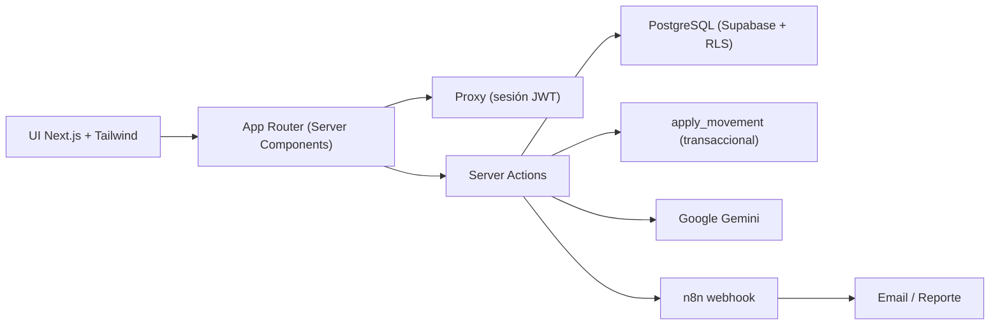

# Hotel Inventory

Aplicación web para el **control del inventario de insumos en el sector hotelero y de hospedaje** (lencería, minibar, artículos de limpieza y demás insumos de operación). 

> **Problemática resuelta:** fugas y desperdicio en la reposición de insumos. La aplicación digitaliza el inventario, genera alertas de stock, detecta patrones de fuga con IA y automatiza reportes por correo.

## Stack tecnológico

| Capa | Tecnología |
|------|------------|
| Frontend | Next.js 16 · TypeScript · Tailwind CSS |
| Backend | Server Actions Next.js + Supabase (Node.js) |
| Base de datos | PostgreSQL (Supabase) con RLS |
| IA | Google Gemini (modelos Flash) + registro de tokens |
| Automatización | n8n (webhook → proceso → IA → email/PDF) |
| Deploy | Vercel · Supabase · n8n Cloud/Docker |
| Control de versiones | GitHub + GitHub Actions (CI/CD) |

## Arquitectura




## Estructura del proyecto

```
hotel-inventory/
├── src/
│   ├── app/                 # Rutas del App Router
│   │   ├── (app)/           # Layout protegido + páginas
│   │   │   ├── dashboard/   # KPIs y alertas
│   │   │   ├── items/       # Catálogo de insumos
│   │   │   ├── inventory/   # Movimientos y stock
│   │   │   ├── minibar/     # Consumos por habitación
│   │   │   ├── linen/       # Ciclo de lencería
│   │   │   ├── alerts/      # Alertas de stock
│   │   │   └── ia/          # IA (Gemini) + automatización
│   │   └── login/           # Inicio de sesión
│   ├── components/          # Sidebar, formularios, kits UI
│   └── lib/
│       ├── actions/         # Server Actions (auth, inventory, ai, automation)
│       ├── supabase/        # Clientes server/browser + proxy de sesión
│       ├── gemini.ts        # Integración Gemini + registro de tokens
│       └── types.ts         # Tipos del dominio
├── supabase/
│   ├── schema.sql           # Esquema completo (tablas, RLS, RPC, vistas)
│   └── seed.sql             # Datos de demostración
├── n8n/
│   └── hotel-inventory-workflow.json  # Flujo de automatización
├── .github/workflows/ci.yml
├── Dockerfile · docker-compose.yml
└── .env.example
```

## Configuración (Setup)

**Requisitos previos:** Node.js ≥ 20, cuenta en Supabase, key de Google AI Studio (Gemini), cuenta Vercel y proyecto n8n.

```bash
# 1. Instalar dependencias
npm install

# 2. Configurar variables de entorno
cp .env.example .env.local
#   Completa NEXT_PUBLIC_SUPABASE_URL, NEXT_PUBLIC_SUPABASE_ANON_KEY,
#   GEMINI_API_KEY, GEMINI_MODEL y N8N_WEBHOOK_URL

# 3. Levantar en desarrollo
npm run dev
```

### Base de datos (documentada en `supabase/`)

1. Crea un proyecto en [Supabase](https://supabase.com).
2. Ejecuta `supabase/schema.sql` en el **SQL Editor**.
3. Ejecuta `supabase/seed.sql` para cargar datos de demostración.
4. Crea los usuarios en **Authentication → Users** (o con el sign-up de la app) y asigna su rol insertando en `profiles`.

> El schema incluye: tipos enumerados, 12 tablas, **seguridad RLS por rol**, función transaccional `apply_movement`, vistas `v_stock_actual` y `v_mermas`, y generación automática de alertas.

## Automatización con n8n

1. Importa `n8n/hotel-inventory-workflow.json` en tu instancia de n8n (Cloud o local con `docker compose up -d n8n`).
2. Configura las credenciales **SMTP** en los nodos de email.
3. Define la variable `GEMINI_API_KEY` en n8n.
4. Activa el workflow y copia la URL del webhook en `N8N_WEBHOOK_URL` de la app.

**Flujo:** Webhook (trigger) → Code (procesamiento) → Gemini (IA) → IF (validación) → Email con reporte y análisis / Email de caso vacío.

## Uso de IA y registro de tokens

- `src/lib/gemini.ts` expone `geminiComplete()` y `logAiUsage()`.
- Cada llamada guarda `prompt_tokens`, `completion_tokens`, `total_tokens` y costo estimado en la tabla **`ai_usage_log`** (visible en "IA y Reportes").
- Funciones: reposición sugerida y detección de fugas/desperdicio.

## Scripts

| Comando | Descripción |
|---------|-------------|
| `npm run dev` | Servidor de desarrollo |
| `npm run build` | Build de producción |
| `npm run start` | Servidor de producción |
| `npm run lint` | Análisis estático (ESLint) |
| `npm run test` | Pruebas |

## Despliegue en Vercel

1. Conecta el repositorio de GitHub en [Vercel](https://vercel.com).
2. Añade las variables de entorno del `.env.example`.
3. Cada `push` a `main` dispara el pipeline de **GitHub Actions** (lint → build → imagen Docker) y el deploy de Vercel.

### Docker

```bash
docker build -t hotel-inventory .
docker compose up -d app n8n
```

